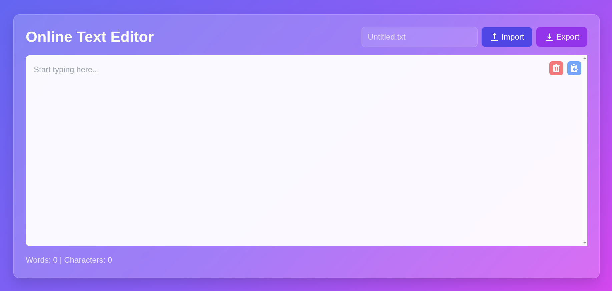

<h1>Online Text Editor</h1>
<a href="https://ktarcher11235.github.io/onlineTextEditor/textEditor.html">Use the editor</a>
<ul>
    <li>Reliable</li>
    <li>Modern looking</li>
    <li>Easy to use</li>
    <li>For desktop use</li>
</ul>

This editor was created in order to provide an online enviroment to create, edit, and view simple files

<h2>Offline</h2>

To use this editor offline, just download it and run on the file protocol.

